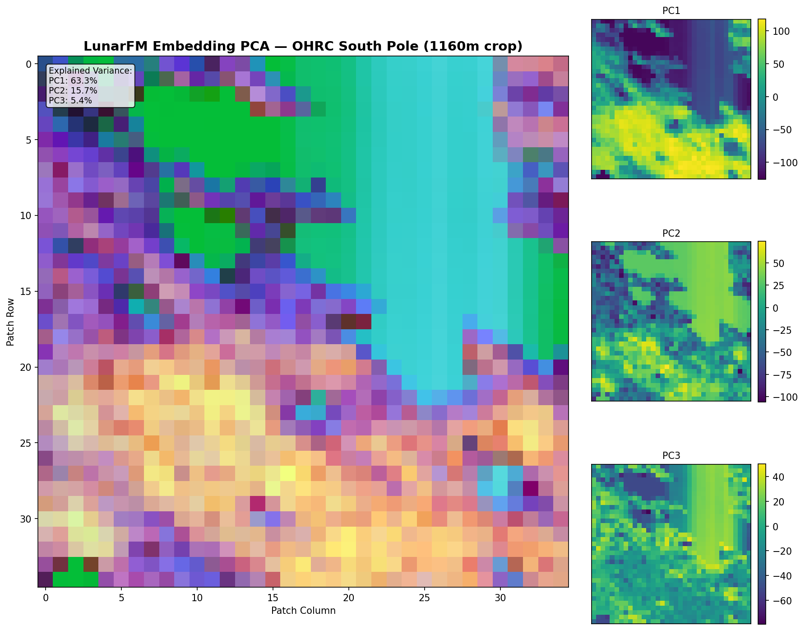
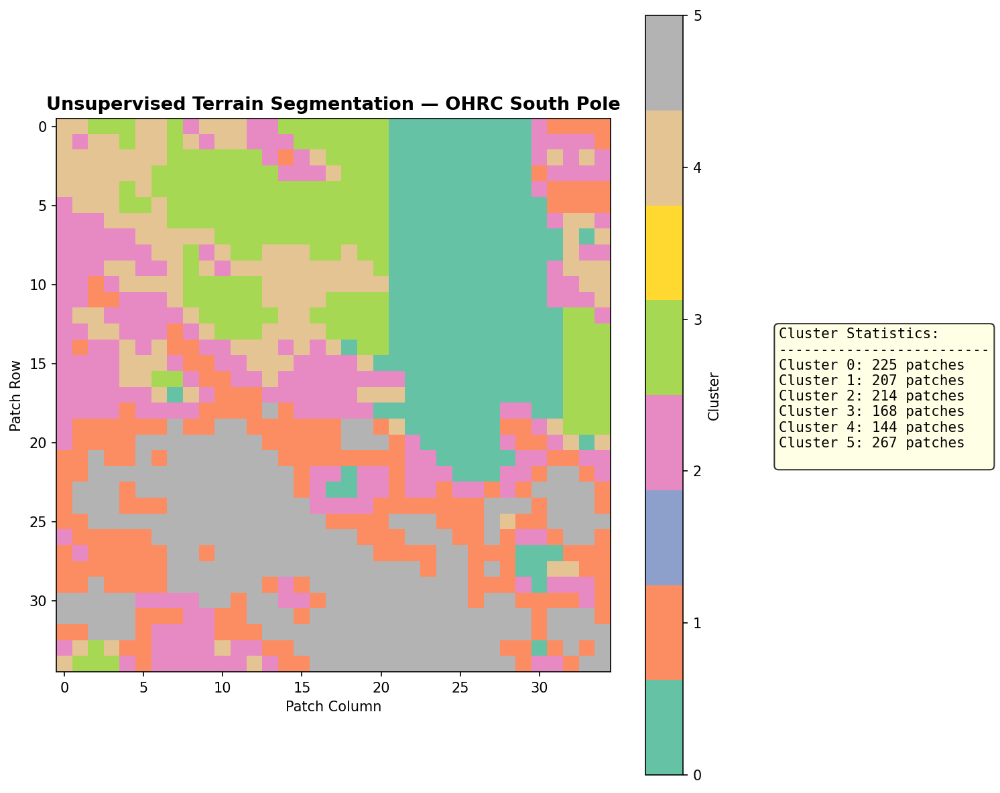
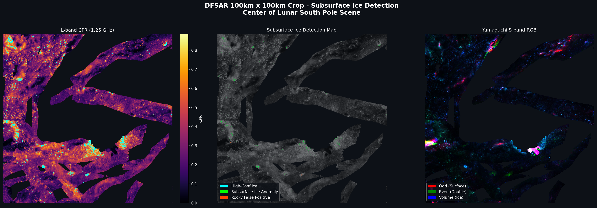

# ISRO Build A Hackathon (BAH) - Problem Statement 8

**Detection and Characterization of Subsurface Ice in Lunar South Polar Regions Using Chandrayaan-2 Radar and Imagery Data for Landing Site and Rover Traverse Planning**

This repository contains an end-to-end processing pipeline integrating high-resolution optical imagery (OHRC) and dual-frequency synthetic aperture radar (DFSAR) from Chandrayaan-2. It satisfies both the Physics-based radar track and the AI-driven representation track of Problem Statement 8.

## 🌌 Pipeline Visualizations

### Optical Analytics (OHRC 0.25m/pixel)
These visualizations are generated automatically by `demo_lunarfm.py`, mapping classical terrain hazards alongside LunarFM AI terrain segmentation.


*Terrain Hazard Map (Roughness, PSR Shadows, Boulder Detection)*


*LunarFM Unsupervised Embeddings (PCA False Color)*


*K-Means Terrain Segmentation (Unsupervised)*

### Radar Analytics (DFSAR L-band / S-band)
These visualizations are generated automatically by `dfsar_processing.py`, combining physics-based CPR metrics with S-band Yamaguchi decompositions to detect deeply buried water-ice.


*DFSAR 100km x 100km South Pole Crop (L-band CPR, Ice Anomaly Map, Yamaguchi RGB)*

---

## 🚀 Quick Start & Reproducibility

### 1. Environment Setup
The pipeline requires Python 3.10+ and heavy remote sensing / deep learning libraries. It is highly recommended to use a Conda environment.

```powershell
# Create and activate environment
conda create -n isro_bah python=3.10 -y
conda activate isro_bah

# Install core scientific and GIS dependencies
pip install numpy rasterio loguru scikit-learn matplotlib psutil

# Install PyTorch (required for LunarFM)
pip install torch torchvision torchaudio --index-url https://download.pytorch.org/whl/cu118
```

### 2. Data & Weights Acquisition
Since radar data, optical imagery, and neural network weights total tens of gigabytes, they are **excluded from this repository via `.gitignore`**. You must download them manually and place them in the correct directory structure.

**A. LunarFM Pre-trained Weights**
The AI pipeline requires the pre-trained LunarFM (MultiMAE) weights. Note that these weights are **not** available on the public ISRO data portal. 
1. The weights are provided separately under a specific licensing agreement by the LunarFM development team. Please follow their official access request process to obtain the files.
2. Once access is granted, download the `last.ckpt` weights file.
3. Place it exactly at: `LunarFM-Science-Release/weights/last.ckpt`

**B. Chandrayaan-2 PRADAN Data**
1. Navigate to the ISRO PRADAN/ISSDC data portal.
2. **For Track 1 (Radar)**: Download the DFSAR L4-MOSAIC bundles for the 2025-06-30 South Pole region (both L-band and S-band).
3. **For Track 2 (Optical)**: Download the OHRC calibrated bundle for 2025-01-25.

### 3. Data Directory Structure
Extract your downloaded files so your project root matches this exact structure:

```text
Isro-BAH-RS/
│
├── ohrc_data/
│   └── data/
│       └── calibrated/
│           └── 20250125/
│               ├── ch2_ohr_ncp_20250125T0328498909_d_img_d18.tif  # High-res optical
│               └── ch2_ohr_ncp_20250125T0328498909_d_img_d18.xml
│
├── dfsar_data/
│   ├── L_band/
│   │   └── data/derived/20250630/
│   │       ├── ch2_sar_ndxl_20250630mpcpspwest_d_cpr_xx_fp_xx_xxx.tif
│   │       ├── ch2_sar_ndxl_20250630mpcpspwest_d_srd_xx_fp_xx_xxx.tif
│   │       └── ch2_sar_ndxl_20250630mpcpspwest_d_trt_xx_fp_xx_xxx.tif
│   └── S_band/
│       └── data/derived/20250630/
│           ├── ch2_sar_ndxl_20250630my4rspwest_d_evn_xx_fp_xx_xxx.tif
│           ├── ch2_sar_ndxl_20250630my4rspwest_d_odd_xx_fp_xx_xxx.tif
│           ├── ch2_sar_ndxl_20250630my4rspwest_d_vol_xx_fp_xx_xxx.tif
│           └── ch2_sar_ndxl_20250630my4rspwest_d_hlx_xx_fp_xx_xxx.tif
│
└── LunarFM-Science-Release/  # Cloned ISRO LunarFM repository
    └── weights/
        └── last.ckpt         # Pre-trained MultiMAE weights
```

### 4. Running the Pipeline

#### Part A: OHRC Optical & AI Pipeline (Hazards & LunarFM)
This script processes the 0.25m/pixel OHRC imagery. It applies classical photogrammetry to extract terrain hazards (shadows, boulders, roughness) and uses the frozen LunarFM AI model to extract spatial embeddings and perform unsupervised terrain segmentation.

```powershell
# Set the environment variable to point to your specific OHRC TIFF
$env:OHRC_PATH = "C:\Users\MRaza\Documents\Isro-BAH-RS\ohrc_data\data\calibrated\20250125\ch2_ohr_ncp_20250125T0328498909_d_img_d18.tif"

# Run the pipeline
python demo_lunarfm.py --data-dir "C:\Users\MRaza\Documents\lunarlab-public"
```
**Outputs**: Generated in `outputs/ohrc_demo/` (Hazard Maps, Boulder Overlays, PCA Embeddings, Terrain Clusters).

#### Part B: DFSAR Radar Pipeline (Subsurface Ice Detection)
This script processes 17 GB of L-band and S-band radar data. It uses a highly memory-efficient tiled approach (row-wise processing) to prevent RAM exhaustion.

```powershell
python dfsar_processing.py
```
**Outputs**: Generated in `outputs/dfsar_results/` (High-confidence ice masks, DOP/CPR maps, Volumetric estimation logs, and a final 600km visual dashboard).

---

## 🏗️ Repository Architecture

- **`dfsar_processing.py`**: Core radar physics pipeline. Implements memory-efficient `rasterio` window reads (500 rows at a time). Calculates DOP from Yamaguchi decompositions, applies ISRO ice thresholds (`CPR > 1.0` & `DOP < 0.87`), computes depth index, and runs volumetric scaling.
- **`demo_lunarfm.py`**: Core optical AI pipeline. Orchestrates data ingestion, classical filtering, and neural network embedding extraction.
- **`lunarfm_pipeline/`**:
  - `ohrc_analytics.py`: Classical computer vision (Laplacian of Gaussian for boulders, rolling standard deviation for surface roughness). Handles OHRC TDI readout column destriping.
  - `model_loader.py`: Reconstructs PyTorch Lightning architecture dynamically from `config.yaml` to load frozen ISRO MultiMAE weights.
  - `preprocessing.py`: Handles grid tiling (112x112 patches) and scene-specific standard scalar normalization.
  - `embeddings.py` & `visualization.py`: Extracts 768-D tokens, performs PCA dimensionality reduction, and applies K-Means spatial clustering.

---

## 📝 Troubleshooting & Notes

1. **OHRC Destriping**: Raw OHRC images often contain vertical column banding due to TDI (Time Delay Integration) CCD readout noise when looking into deep shadows. `ohrc_analytics.py` applies a mandatory column-wise zero-mean destriping pass before processing.
2. **Memory Limits (DFSAR)**: The DFSAR L4-MOSAIC products total ~16.8 GB. `dfsar_processing.py` uses row-chunking. Do *not* attempt to load the entire arrays into memory `src.read(1)` unless you have 64GB+ of RAM.
3. **Model Normalization**: LunarFM weights were trained on Clementine data. Applying Clementine global statistics to OHRC data crushes the dynamic range due to vastly different lighting geometries at the South Pole. The pipeline utilizes **scene-specific Z-score normalization** before passing patches to the MultiMAE encoder.
