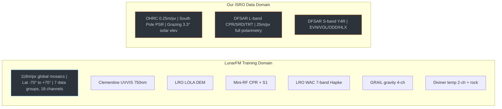
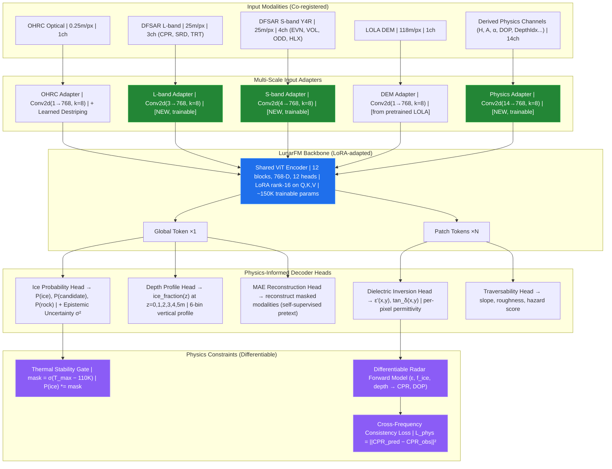
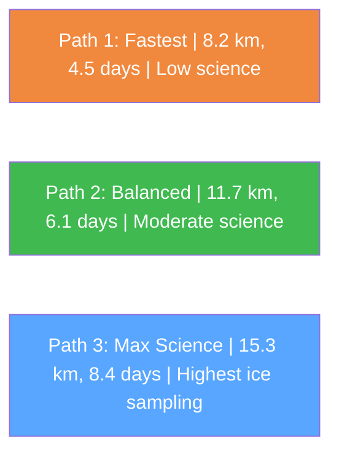
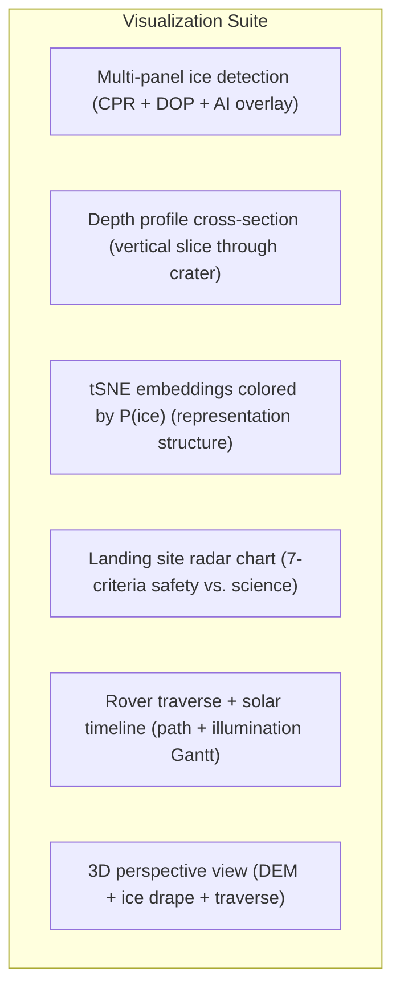
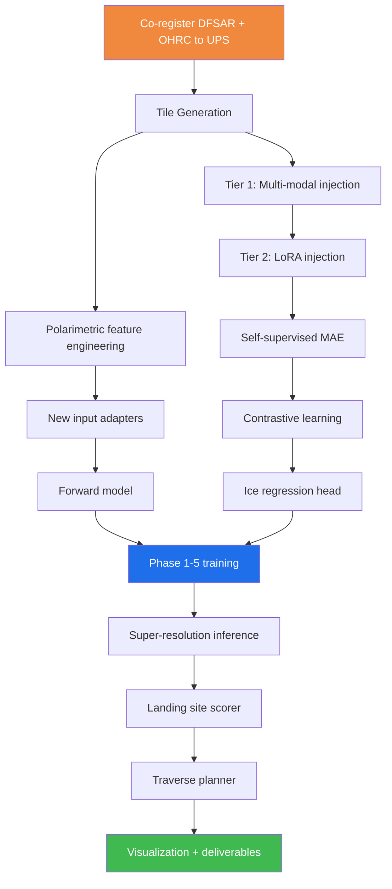

# LunarFM-IceNet: Hackathon Plan
## Physics-Informed Foundation Model Adaptation for Subsurface Lunar Ice Detection, Characterization & Mission Planning
**ISRO Bharatiya Anthariksh Hackathon — Problem Statement 8**

---

## Executive Summary

Our current pipeline operates as **two disconnected tracks**: physics-based DFSAR ice detection (CPR thresholds + DOP filtering) runs independently of LunarFM's AI-driven terrain segmentation (frozen encoder + K-Means clustering). The outputs are overlaid post-hoc but never fused at the representation level.

**LunarFM-IceNet** eliminates this gap by adapting ISRO's own LunarFM foundation model to natively understand Chandrayaan-2 DFSAR polarimetry — fusing optical and radar information inside the transformer so the model learns the joint physics of subsurface ice scattering, not just surface texture statistics. Training is constrained by a differentiable radar forward model that ensures every prediction is consistent with electromagnetic theory and thermophysical volatile stability.

The plan is organized into **three implementation tiers** of increasing ambition so we can deliver a working system at any stopping point, with each tier strictly improving upon the last.

---

# Part I — The Problem: Domain Gap Analysis

## 1. What LunarFM Knows vs. What We Need



> [!IMPORTANT]
> **Five critical domain gaps:**
> 1. **Resolution**: 118m training vs. 0.25m OHRC (472× finer) and 25m DFSAR
> 2. **Latitude**: Trained ±70° — the south pole (>85°S) is completely **out-of-distribution**
> 3. **Illumination**: Training on sunlit mosaics; OHRC has 3.3° grazing sun with deep PSR shadows
> 4. **Missing modality**: DFSAR full polarimetry has **no equivalent** in training — Mini-RF is a different instrument at different frequency, resolution, and polarimetric decomposition
> 5. **Normalization**: Force-fitting OHRC into `ClementineUVVISMosaic` stats (mean=39.16, std=13.05) is a lossy approximation

## 2. Why Current Embeddings Are Biased

The frozen LunarFM encoder has **never seen**: terrain at 0.25m resolution, permanently shadowed terrain, SAR polarimetric decompositions at L/S-band, or subsurface scattering signatures of any kind. The unsupervised K-Means clustering captures **low-level texture** (edges, gradients, contrast), not **ice-relevant physics**.

---

# Part II — The Physics: First Principles of Radar Ice Detection

## 3. Electromagnetic Wave Propagation in Lunar Regolith

### 3.1 The Medium: Regolith as a Lossy Dielectric

| Property | Value | Source |
|---|---|---|
| Real permittivity ε' (dry regolith) | 2.5 – 3.5 | Carrier et al. 1991 |
| Loss tangent tan δ (dry) | 0.005 – 0.015 | Olhoeft & Strangway 1975 |
| Density ρ (top 1m) | 1.3 – 1.8 g/cm³ | Apollo samples |
| Porosity φ | 40% – 55% | LOLA roughness |
| Temperature (PSR) | 25 – 50 K | Diviner |
| Water ice ε' (at 40K) | 3.1 – 3.2 | Mätzler 1998 |
| Water ice tan δ (at 40K) | ~10⁻⁴ | Extremely low loss |

At cryogenic temperatures (25-50K in PSRs), water ice has an **extremely low loss tangent** — almost perfectly transparent to radar. L-band (1.25 GHz, λ ≈ 24 cm) penetrates 3-5 meters; S-band (2.5 GHz, λ ≈ 12 cm) penetrates 1-2 meters through ice-bearing regolith. But the **interfaces** between ice grains and regolith particles cause scattering.

### 3.2 Why CPR > 1 Implies Ice: The Coherent Backscatter Opposition Effect

When a circularly polarized wave encounters a **smooth surface**, specular reflection flips handedness. One bounce → opposite circular (OC) dominates same-circular (SC) → CPR = SC/OC < 1.

In an **ice-rich volume**, ice grains (mm to cm scale) with dielectric contrast Δε ≈ 0.5-1.0 act as partial reflectors. Multiple internal scattering randomizes polarization (SC ≈ OC). The **coherent backscatter opposition effect (CBOE)** — constructive interference of time-reversed scattering paths in the exact backscatter direction — preferentially boosts SC, pushing CPR above unity.

> **CBOE** requires a specific physical configuration (randomly distributed volume scatterers with mean free path comparable to wavelength) that surface roughness alone cannot easily produce.

### 3.3 The Ambiguity Problem: Why Thresholds Fail

**Rocky terrain can also produce CPR > 1.** Wavelength-scale boulders (20-30 cm for L-band) create double-bounce dihedral scattering, preserving handedness → high SC. Chaotic boulder fields produce enough multiple paths to occasionally achieve CBOE.

The DOP filter (DOP < 0.87 → ice) helps because:
- **Rocks**: coherent double-bounce → **high DOP** (ordered)
- **Ice**: incoherent volume scattering → **low DOP** (disordered)

But this is a **1D projection** of a fundamentally **16-parameter** scattering process. We're discarding most of the information.

---

## 4. The Full Polarimetric Information Content

### 4.1 What We're Currently Using vs. What Exists

The complete DFSAR measurement at each pixel is a **2×2 scattering matrix** S → a **4×4 Mueller matrix** (16 independent parameters) → a **3×3 coherency matrix** T₃.

Our current pipeline extracts only:
- **CPR** = |S_SC|² / |S_OC|² — **1 number** from 16
- **DOP** = √(S₁² + S₂² + S₃²) / S₀ — **1 more number**
- **Yamaguchi** → 4 powers (Even, Odd, Volume, Helix) — **4 numbers**

**We use at most 6 of 16 available degrees of freedom.** The remaining 10 contain phase differences, off-diagonal coherency terms, and helicity — all carrying scatterer information.

### 4.2 Cloude-Pottier H-A-α Decomposition

Eigen-decompose the coherency matrix T₃ = Σᵢ λᵢ eᵢ eᵢ† to get:

| Parameter | Formula | Physical Meaning | Ice Signature | Rock Signature |
|---|---|---|---|---|
| **Entropy H** | −Σ pᵢ log₃(pᵢ) | Scattering randomness | 0.7–0.9 (random) | 0.4–0.7 (organized) |
| **Anisotropy A** | (λ₂−λ₃)/(λ₂+λ₃) | Secondary mechanism importance | 0.1–0.3 (no dominant) | Variable |
| **Mean alpha ᾱ** | Σ pᵢ αᵢ | Scattering type | 30°–50° (vol+surf mix) | 50°–70° (dihedral) |

The H-A-α space provides **dramatically better** ice-rock separation than CPR-DOP alone.

### 4.3 Physics-Derived Channel Engineering

**From L-band (CPR, SRD, TRT):**

| Derived Channel | Formula | Physical Meaning |
|---|---|---|
| m-chi: Blue | (SC − OC) × sin(2χ) | Surface single-bounce |
| m-chi: Red | (SC − OC) × cos(2χ) | Double-bounce dihedral |
| m-chi: Green | OC − SC | Volume diffuse |
| Relative phase | arg(S_LL × S_RR*) | Scatterer orientation |

**From S-band Yamaguchi (EVN, VOL, ODD, HLX):**

| Derived Channel | Formula | Physical Meaning |
|---|---|---|
| Entropy H | −Σ pᵢ log₃(pᵢ) from Y4R | Scattering randomness |
| Volume fraction | VOL / Σ(Y4R) | Ice-sensitive: vol. scattering dominance |
| Helix fraction | HLX / Σ(Y4R) | Asymmetric scatterer indicator |
| DOP proxy | 1 − vol_fraction | Polarization order |
| Span | Σ(Y4R) | Total backscatter intensity |

**Cross-frequency:**

| Derived Channel | Formula | Physical Meaning |
|---|---|---|
| Depth index | CPR_L − CPR_S_proxy | Subsurface gradient indicator |
| Frequency ratio | σ⁰_L / σ⁰_S | Scatterer size distribution probe |
| Differential entropy | H_L − H_S | Depth-dependent randomness change |

**Total: 7 raw + 14 derived = 21 channels** of physics-encoded radar information.

### 4.4 Dual-Frequency Penetration Physics

Skin depth δ = λ / (2π × √(ε'/2) × √(√(1 + tan²δ) - 1)):
- **L-band**: δ ≈ 3.2 m
- **S-band**: δ ≈ 1.6 m

The dual-frequency response encodes the **vertical distribution** of ice:

```
CPR_L >> CPR_S  →  ice at 1.6-3.2m depth (L sees it, S doesn't)
CPR_L ≈ CPR_S >> 1  →  ice surface to 1.6m (both see it)
CPR_L > 1, CPR_S < 1  →  ice below 1.6m only
```

A neural network can learn this inverse transform implicitly from the dual-frequency inputs.

---

## 5. Thermophysical Constraints — Where Ice Can Physically Exist

### 5.1 Volatile Stability

Ice survives long-term (>1 Gyr) only where T_max < ~110K. In PSRs, the thermal budget depends on: direct solar illumination (zero), scattered sunlight from crater walls, thermal IR from warm walls, and cosmic ray gardening (~1 mm/Myr).

**Doubly shadowed craters** (shadowed from both direct and wall-scattered light) reach T < 30K — the coldest places on the Moon, where even CO₂ and molecular hydrogen may be cold-trapped.

### 5.2 Illumination Modeling as a Hard Prior

From LOLA DEM + solar ephemeris, compute the **annual peak illumination** and **sky view factor** at every pixel:

```
SVF(x,y) = (1/2π) ∫₀²π max(0, π/2 − horizon_angle(θ)) dθ
```

This provides a hard physical prior: P(ice | T_max > 110K) ≈ 0. This must be **built into the model architecture** as a multiplicative gate, not a post-hoc filter.

---

# Part III — The Architecture: LunarFM-IceNet

## 6. System Architecture



---

## 7. Multi-Resolution Multi-Modality Encoding

### 7.1 The Resolution Mismatch Problem

OHRC (0.25m), DFSAR (25m), DEM (118m) span 472× in resolution. Resampling destroys information.

**Solution: Hierarchical Cross-Attention**

1. **Fine branch** (OHRC): Tile at 0.25m → 112×112 patches = 28m×28m coverage → fine tokens
2. **Coarse branch** (DFSAR): Look up the corresponding DFSAR pixel(s) for each OHRC tile → broadcast to 112×112 → coarse tokens
3. **Cross-scale fusion**: Fine tokens attend to coarse tokens via cross-attention → "what does the radar say about the terrain I'm seeing optically?"

This mirrors human interpretation: high-res photo for surface texture, radar overlay for subsurface.

### 7.2 Shadow-Aware Normalization

Standard z-score normalization destroys shadow-region information (90%+ near-zero pixels).

**Adaptive Log-Stretch Normalization**:
```
x_norm = sign(x − μ_shadow) × log(1 + |x − μ_shadow| / σ_shadow) / log(1 + k)
```

Preserves subtle albedo variations within shadows that could correlate with surface frost — invisible under standard normalization.

### 7.3 Distribution Alignment Bridge

For OHRC through the Clementine adapter (Tier 1):
```
OHRC_aligned = ((OHRC - μ_OHRC) / σ_OHRC) × σ_Clem + μ_Clem
```

Then standard z-score. Histogram-matches to the training distribution. Clip deep shadow pixels to Clementine's p1=11.0.

---

## 8. Physics-Informed Training Losses

### 8.1 Differentiable Radar Forward Model

Given predicted subsurface properties, simulate what the radar would measure:

```python
def radar_forward_model(epsilon_r, ice_fraction, depth_profile, frequency):
    """
    Differentiable: predicted subsurface → predicted radar observables
    Gradients flow back through the physics.
    """
    eps_ice = 3.15  # water ice at 40K
    eps_reg = epsilon_r  # predicted by model
    
    # Step 1: Maxwell-Garnett effective permittivity per depth bin
    for z_bin in range(6):
        f = ice_fraction[:, z_bin]
        eps_eff = eps_reg * (1 + 3*f*(eps_ice - eps_reg) / 
                  (eps_ice + 2*eps_reg - f*(eps_ice - eps_reg)))
        
        # Step 2: Fresnel reflectivity at layer boundaries
        R = ((sqrt(eps_eff[z]) - sqrt(eps_eff[z+1])) / 
             (sqrt(eps_eff[z]) + sqrt(eps_eff[z+1])))**2
        
        # Step 3: Two-way attenuation
        delta = wavelength / (2*pi*sqrt(eps_eff/2)*sqrt(sqrt(1+tan_d**2)-1))
        attenuation = exp(-2 * depth / delta)
    
    # Step 4: Volume scattering (Rayleigh regime)
    sigma_vol = N_ice * (2*pi/wavelength)**4 * |alpha|**2 * V_grain**2
    
    # Step 5: CPR from volume fraction
    CPR_pred = (sigma_vol + sigma_surface_SC) / (sigma_surface_OC + sigma_vol)
    
    return CPR_pred, sigma0_pred, DOP_pred
```

### 8.2 Composite Loss Function

```
L_total = L_MAE                    (self-supervised reconstruction)
        + λ₁ × L_ice              (supervised ice classification from DFSAR labels)
        + λ₂ × L_physics          (forward model consistency)
        + λ₃ × L_contrast         (cross-modal contrastive InfoNCE)
        + λ₄ × L_thermal          (thermal stability constraint)
```

| Loss | Formula | What It Enforces |
|---|---|---|
| **L_MAE** | MSE(reconstructed, original) | General feature learning via masked autoencoding |
| **L_ice** | BCE(P_pred, y_DFSAR) | Ice detection accuracy from self-generated labels |
| **L_physics** | ‖CPR_pred − CPR_obs‖² + ‖DOP_pred − DOP_obs‖² | Electromagnetic consistency |
| **L_contrast** | −log(exp(sim(z_opt, z_rad⁺)/τ) / Σ exp(sim(z_opt, z_rad_j)/τ)) | Cross-modal alignment |
| **L_thermal** | ReLU(P_ice × (T_max − 110))² | Thermophysical impossibility |

### 8.3 Why This Matters

With L_physics, the model doesn't learn statistical correlations (pattern → label). It learns representations that, decoded through the forward model, **reproduce actual radar measurements**. Internal representations must encode ε_r and ice_fraction in physically meaningful ways. The model can **extrapolate** beyond training distribution because predictions are constrained by physics — crucial for PSRs, which are unlike anything in the training set.

---

## 9. Depth-Resolved Ice Mapping

### 9.1 Neural Depth Profiler

The Depth Profile Head outputs a 6-bin histogram of ice fraction vs. depth:

```
f(z) = [f₀₋₁, f₁₋₂, f₂₋₃, f₃₋₄, f₄₋₅, f₅₊]
```

**Training signal**: The differentiable forward model converts each profile to predicted L-band and S-band responses. The consistency loss ensures the profile actually explains the observed dual-frequency measurements.

**Physical constraint** (monotonic by construction):
```python
f_z = torch.cumsum(softplus(raw_output), dim=1)
f_z = f_z / f_z[:, -1:] * f_max  # Normalize to max ice fraction
```

### 9.2 Volumetric Estimation with Uncertainty

```
Volume(pixel) = Σ_z f(z) × Δz × pixel_area = Σ_{z=0}^{5} f_z × 1m × (25m)²
Total_volume = Σ_pixels Volume(pixel)
Uncertainty = √(Σ_pixels Var(Volume(pixel)))  [MC-Dropout, 20 forward passes]
```

Replaces the uniform 5-10% assumption with **spatially-varying, depth-resolved, uncertainty-quantified** estimates.

---

## 10. Cross-Modal Super-Resolution Ice Mapping

### 10.1 The Core Innovation

DFSAR detections are at 25m. OHRC is at 0.25m. We train the multi-modal model to predict DFSAR-derived ice labels from OHRC features. At inference, run OHRC alone → 0.25m ice probability maps.

The model learns: "this shadow + texture pattern at 0.25m always co-occurs with high CPR at 25m."

This is **radar-guided optical super-resolution** — a 100× improvement in ice mapping resolution.

### 10.2 Uncertainty-Aware Prediction

Use MC-Dropout (20 forward passes) or Deep Ensemble (3-5 seeds) to produce:
- Mean: P̄(ice)
- Epistemic uncertainty: Var(P(ice))

High P̄ + low variance = **highest-confidence ice sites**.

---

## 11. Doubly Shadowed Crater Characterization

### 11.1 Detection via Sky View Factor

Compute SVF from LOLA DEM. Pixels with low SVF + inside PSR = doubly shadowed candidates. Feed as input channel so the model learns: low SVF + specific radar → highest ice probability.

### 11.2 Crater Morphometry from OHRC

At 0.25m, extract: d/D ratio (depth/diameter), rim sharpness, floor roughness, wall slope distribution. Fresh craters (d/D ≈ 0.2) → less infill → ice closer to surface.

---

## 12. Landing Site Selection

### 12.1 Seven Operational Constraints

| Criterion | Constraint | Source |
|---|---|---|
| Slope | < 15° | DEM |
| Roughness | < 0.5m RMS at 5m baseline | OHRC |
| Boulder density | < 5% area | OHRC (LoG detector) |
| Illumination | ≥ 200 hrs/year continuous | DEM + ephemeris |
| Ice proximity | < 5 km from high-P(ice) | Model output |
| Communication | Line-of-sight to Earth/relay | DEM + Earth ephemeris |
| Flat area | ≥ 100m×100m at < 5° | DEM + OHRC |

### 12.2 Multiplicative Suitability Score

```
S_land(x,y) = Π_i [satisfy_i(x,y)]^{w_i}
```

Any single failure → score collapses to 0. Fuzzy membership functions with physically motivated spreads.

### 12.3 Embedding Anomaly Safety Layer

```
anomaly_score(x,y) = ||z(x,y) − μ_training||² / σ²_training
```

High anomaly = terrain the model has never seen → potentially hazardous → penalize landing score.

---

## 13. Rover Traverse Planning

### 13.1 AI-Informed Cost Surface

```python
cost(x,y) = (
    w1 * slope_cost(DEM)                    # Energy: slope → motor power
  + w2 * roughness_cost(OHRC)               # Wear: rough → wheel damage
  + w3 * shadow_penalty(illum_map)          # Power: shadow → no solar
  + w4 * thermal_risk(T_max)               # Thermal: too cold → electronics
  + w5 * embedding_anomaly(LunarFM)        # Safety: unknown terrain → risk
  - w6 * ice_reward(P_ice)                 # Science: ice → reward
  + w7 * comm_shadow(LOS_map)             # Comms: blocked → loss of contact
)
```

### 13.2 Solar-Constrained Time-Expanded Graph

Instead of static 2D, create a **3D cost graph** (x, y, t):

```
cost(x, y, t) = base_cost(x,y) + solar_penalty(x,y,t)
solar_penalty = ∞  if no sun AND battery < threshold
solar_penalty = 0  if sun above horizon
```

Time-dependent A* / D* Lite that plans considering when the rover arrives at each waypoint and whether solar power is available.

### 13.3 Multi-Objective Pareto Optimization

Use NSGA-II to generate Pareto front:
- **Minimize**: traverse time + cumulative hazard
- **Maximize**: cumulative ice probability (science yield)



Each path includes: waypoint illumination timeline, battery SoC projection, per-waypoint ice probability + recommended drill depth, emergency abort paths to sunlit terrain.

---

# Part IV — Implementation Strategy: Three Tiers

## 14. Tier 1 — Embedding-Space Adaptation (No Weight Changes)

> **Effort: 3-5 hours | Risk: Low | Reward: Medium**
> **Prerequisites: None (works with existing pipeline)**

### 14.1 Scope

| Task | What to Do | Time | Files to Modify |
|---|---|---|---|
| **Distribution alignment** | Histogram-match OHRC to Clementine stats before z-score | 1 hr | [preprocessing.py](file:///c:/Users/MRaza/Documents/Isro-BAH-RS/lunarfm_pipeline/preprocessing.py) |
| **Multi-modal injection** | Re-normalize DFSAR CPR→Mini-RF CPR stats, SRD→Mini-RF S1 stats; pass as 2nd modality | 1.5 hr | [embeddings.py](file:///c:/Users/MRaza/Documents/Isro-BAH-RS/lunarfm_pipeline/embeddings.py), [demo_lunarfm.py](file:///c:/Users/MRaza/Documents/Isro-BAH-RS/demo_lunarfm.py) |
| **Hybrid embeddings** | Concatenate global_token (768-D) with [CPR, DOP, depth_idx, shadow_frac, roughness] → 773-D | 1 hr | [classifier.py](file:///c:/Users/MRaza/Documents/Isro-BAH-RS/lunarfm_pipeline/classifier.py) |
| **Multi-view fusion** | Pass {OHRC, DFSAR, DEM} as multi-modal dict to encoder | 1.5 hr | [model_loader.py](file:///c:/Users/MRaza/Documents/Isro-BAH-RS/lunarfm_pipeline/model_loader.py) |

### 14.2 Key Implementation Detail

```python
# Current (single-modality, suboptimal):
x = {'ClementineUVVISMosaic': ohrc_tensor}

# Tier 1 (multi-modal, leverages existing adapters):
x = {
    'ClementineUVVISMosaic': ohrc_aligned,              # 1ch, histogram-matched
    'MiniRF_Global_Mosaic': dfsar_cpr_srd_renormed,     # 2ch, CPR+SRD
    'LRO_LOLA_Global_LDEM_118m_Mar2014': dem_tensor,    # 1ch, elevation
}
```

The MultiMAE encoder tokenizes each modality through its adapter and processes all tokens jointly. Cross-modal attention lets radar and optical tokens interact.

### 14.3 Expected Improvement

Hybrid embeddings + multi-modal fusion → clustering captures **physics-relevant** terrain classes (ice-bearing PSR, rocky, smooth regolith) instead of just texture.

---

## 15. Tier 2 — LoRA Fine-Tuning + Contrastive Learning

> **Effort: 8-12 hours | Risk: Medium | Reward: High**
> **Prerequisites: GPU ≥ 4GB VRAM, co-registered DFSAR-OHRC tiles**

### 15.1 Why LoRA

The MultiMAE encoder has ~86M parameters. Full fine-tuning on small data → catastrophic forgetting. LoRA injects tiny trainable matrices (rank 4-16) into attention layers while freezing originals:

```
Q = (W_q + B_q × A_q) × x
A ∈ R^(768×r), B ∈ R^(r×768), r=16 → ~12K params/layer → ~150K total
```

### 15.2 Scope

| Task | What to Do | Time | Files |
|---|---|---|---|
| **Tile generation** | OHRC → 10K+ tiles at 112×112 at 0.25m; co-registered DFSAR tiles at 25m | 2 hr | New: `tile_generator.py` |
| **LoRA injection** | Add LoRA adapters to all QKV projections in encoder blocks | 2 hr | [multimae.py](file:///c:/Users/MRaza/Documents/Isro-BAH-RS/LunarFM-Science-Release/src/lunarlab/models/multi_mae/multimae.py) |
| **Self-supervised adaptation** | MAE reconstruction on south pole OHRC+DFSAR data | 3 hr (training) | New: `finetune_lunarfm.py` |
| **Cross-modal contrastive** | InfoNCE on co-located OHRC-DFSAR patch pairs | 2 hr (training) | Same file |
| **Ice regression head** | MLP(768→256→64→4) predicting [P(ice), P(candidate), P(FP), depth_idx] | 1 hr | [classifier.py](file:///c:/Users/MRaza/Documents/Isro-BAH-RS/lunarfm_pipeline/classifier.py) |

### 15.3 Training Config

```yaml
base_model: last.ckpt
adaptation: lora
lora_rank: 16
lora_alpha: 32
lora_target_modules: ['qkv', 'proj']
mask_fraction: 0.85

optimizer: AdamW
learning_rate: 5e-5
weight_decay: 0.01
warmup_steps: 100
max_steps: 2000
batch_size: 8
```

### 15.4 Self-Labeling

**No manual annotation**. All labels from existing DFSAR pipeline:

| Label | Source | Count |
|---|---|---|
| ice_highconf | CPR > 1.0 AND DOP < 0.87 | 730K pixels |
| ice_candidate | CPR > 0.8 AND DOP < 0.80 | 2.79M pixels |
| rock_falsepos | CPR > 1.0 AND DOP ≥ 0.87 | 37.7K pixels |
| depth_index | CPR_L − CPR_S | All valid |

### 15.5 Expected Improvement

LoRA-adapted embeddings + contrastive alignment + supervised ice head → LunarFM becomes an **ice probability predictor** operating on optical data at 100× finer resolution than DFSAR.

---

## 16. Tier 3 — Full LunarFM-IceNet with Physics Constraints

> **Effort: 16-24 hours | Risk: High | Reward: Very High (Award-Winning)**
> **Prerequisites: GPU ≥ 8GB VRAM, co-registered multi-modal data, Tier 2 completed**

### 16.1 Scope

| Task | What to Do | Time | Files |
|---|---|---|---|
| **New input adapters** | DFSAR L-band (3ch), S-band (4ch), Physics (14ch) PatchedInputAdapters | 3 hr | [input_adapters.py](file:///c:/Users/MRaza/Documents/Isro-BAH-RS/LunarFM-Science-Release/src/lunarlab/models/multi_mae/input_adapters.py), [model_loader.py](file:///c:/Users/MRaza/Documents/Isro-BAH-RS/lunarfm_pipeline/model_loader.py) |
| **Derived channels** | Compute H-A-α, m-chi, cross-freq ratios from raw DFSAR | 2 hr | New: `polarimetric_features.py` |
| **Forward model** | Differentiable Maxwell-Garnett + Fresnel + Mie model in PyTorch | 3 hr | New: `radar_forward_model.py` |
| **Multi-task heads** | Ice prob, depth profiler, dielectric inversion, traversability, MAE recon | 2 hr | New: `decoder_heads.py` |
| **Thermal gate** | SVF + illumination computation → multiplicative constraint layer | 1.5 hr | New: `thermal_prior.py` |
| **Phase 1-5 training** | Adapter warmup → LoRA MAE → contrastive → supervised+physics → end-to-end | 10 hr (GPU) | `finetune_lunarfm.py` |
| **Super-resolution inference** | Run OHRC-only through trained model → 0.25m ice maps | 1 hr | New: `inference_pipeline.py` |
| **Rover traverse planner** | Solar-constrained time-dependent A* + NSGA-II Pareto optimization | 3 hr | New: `traverse_planner.py` |

### 16.2 Five-Phase Training Schedule

| Phase | Task | Duration |
|---|---|---|
| **Phase 1: Adapter Warmup** | Freeze encoder, train new adapters only | 2h |
| **Phase 2: Self-Supervised Domain Adaptation** | LoRA blocks 6-11, MAE recon on south pole | 4h |
| **Phase 3: Cross-Modal Contrastive** | OHRC-DFSAR contrastive + MAE joint | 4h |
| **Phase 4: Supervised Ice + Physics** | Ice head + forward model + thermal gate | 6h |
| **Phase 5: End-to-End Fine-Tuning** | All losses jointly, all 12 blocks, low LR | 4h |

**Phase 1** (2h): Only new adapters train. Loss = MAE reconstruction of DFSAR. Goal: adapter tokens compatible with frozen encoder space.

**Phase 2** (4h): LoRA in blocks 6-11. Loss = MAE on south pole OHRC+DFSAR. Goal: adapt attention to polar terrain geometry and shadows.

**Phase 3** (4h): Add InfoNCE contrastive loss. Same location in OHRC and DFSAR → similar embeddings. Goal: modality-invariant terrain representations.

**Phase 4** (6h): Attach supervised heads. Loss = L_ice + L_physics + L_thermal. Goal: ice-relevant features constrained by physics.

**Phase 5** (4h): All losses jointly, cosine anneal to 1e-6, LoRA in all 12 blocks. Goal: end-to-end refinement.

### 16.3 Hyperparameters

```yaml
optimizer: AdamW
base_lr: 1e-4 (Phase 1-2), 5e-5 (Phase 3-4), 1e-5 (Phase 5)
weight_decay: 0.05
warmup: 200 steps per phase
batch_size: 8 (gradient accumulation × 4 → effective 32)
precision: mixed float16
LoRA_rank: 16
LoRA_alpha: 32
LoRA_dropout: 0.05
loss_weights: λ_MAE=1.0, λ_ice=2.0, λ_physics=0.5, λ_contrast=1.0, λ_thermal=0.1
```

---

# Part V — Data Pipeline

## 17. Co-Registration Protocol

All modalities → **UPS (Universal Polar Stereographic)** — the native projection of DFSAR L4.

```
DFSAR (25m UPS)  →  MASTER GRID
OHRC (0.25m s/c frame)  →  reproject to UPS at 0.25m (or 1m compromise)
LOLA DEM (118m)  →  reproject to UPS, bilinear interpolate to 25m
Derived channels  →  computed on co-registered grids
```

> [!WARNING]
> Co-registration is a **hard prerequisite** for Tiers 2/3. Use GDAL: `gdalwarp -t_srs EPSG:32761 -tr 25 25 -r bilinear input.tif output_ups.tif`

## 18. Chip Generation (Two Scales)

**Scale 1 — Radar scale (25m/px):**
- 112×112 = 2.8km × 2.8km per chip
- Contains: 7 raw + 14 derived DFSAR channels, DEM, illumination, thermal
- For: adapter training, ice regression, forward model consistency

**Scale 2 — Optical scale (1m/px downsample):**
- 112×112 = 112m × 112m per chip
- Contains: OHRC + co-registered DFSAR (upsampled/tiled)
- For: contrastive learning, super-resolution ice mapping

## 19. Self-Generated Labels

| Label | Source | Coverage |
|---|---|---|
| ice_highconf | CPR > 1.0 AND DOP < 0.87 | 730K pixels |
| ice_candidate | CPR > 0.8 AND DOP < 0.80 | 2.79M pixels |
| rock_falsepos | CPR > 1.0 AND DOP ≥ 0.87 | 37.7K pixels |
| depth_index | CPR_L − CPR_S | All valid |
| CPR, DOP (continuous) | Direct from DFSAR | All valid |
| shadow_mask | OHRC thresholding | All OHRC pixels |
| roughness | OHRC spatial σ | All OHRC pixels |

---

# Part VI — Evaluation & Validation

## 20. Ablation Studies

| Experiment | What's Removed | Expected Impact |
|---|---|---|
| A: No LoRA | Frozen encoder only | −15% ice F1 (domain gap) |
| B: No DFSAR adapter | OHRC-only model | −40% ice F1 (no radar) |
| C: No physics loss | Standard CE+MAE only | −10% ice F1 (uncalibrated) |
| D: No contrastive | No cross-modal alignment | −20% ice recall |
| E: No depth profiler | Single-bin fraction | Poorer volume estimate |
| F: No thermal gate | No temperature constraint | +5% false positives |

## 21. Validation Strategy

### 21.1 Internal: 4-Fold Spatial Cross-Validation
Split DFSAR scene into 4 quadrants. Train on 3, validate on 1. Report mean ± std of ice F1, volume estimate error.

### 21.2 Physics Sanity Checks
- CPR-predicted vs CPR-observed correlation > 0.85
- Predicted ε_r in [2.5, 4.0]
- Ice predictions cluster in PSR regions
- Depth profiles monotonic, fraction < 30%

### 21.3 External Validation
- Compare against Mini-RF detections (LRO) — independent instrument
- Compare against Lunar Prospector neutron spectrometer hydrogen maps
- Compare doubly shadowed locations against Mazarico et al. 2011 catalogs

---

# Part VII — Deliverables & Presentation

## 22. Output Products

| Deliverable | Resolution | Description |
|---|---|---|
| **Ice probability map** | 25m | Full scene P(ice) with calibrated uncertainty |
| **Super-resolution ice map** | 0.25m | Doubly shadowed crater, OHRC-derived |
| **Depth profile map** | 25m | 6-bin vertical ice distribution per pixel |
| **Volume estimate** | Scene-wide | Spatially-varying, uncertainty-quantified |
| **Landing site scores** | 25m | Top-3 sites with 7-criteria radar charts |
| **Rover traverse plans** | — | 3 Pareto-optimal paths with solar timeline |
| **Ablation table** | — | Proving each component contributes |
| **LunarFM-IceNet weights** | — | Fine-tuned checkpoint for ISRO deployment |

## 23. Visual Products



## 24. The Winning Narrative

> We present **LunarFM-IceNet**: the first physics-informed adaptation of a lunar foundation model for subsurface volatile characterization. Starting from ISRO's pretrained LunarFM architecture, we inject Chandrayaan-2's dual-frequency SAR polarimetry as native input modalities with 21 physics-engineered channels encoding H-A-α decomposition, m-chi classification, and cross-frequency depth probing. We fine-tune the encoder via Low-Rank Adaptation on south polar terrain, and train multi-task heads for ice probability, depth profiling, and dielectric inversion — all constrained by a **differentiable radar forward model** implementing Maxwell-Garnett mixing theory, Fresnel layer reflection, and Mie volume scattering. A thermal stability gate derived from DEM illumination modeling enforces the thermophysical impossibility of ice in warm terrain.
>
> The result: (1) spatially-resolved ice probability maps with calibrated epistemic uncertainty, (2) depth-resolved ice fraction profiles enabling the first physics-constrained volumetric estimate from Chandrayaan-2 data, (3) super-resolution ice mapping at 0.25m via learned optical-radar transfer, (4) landing site recommendations satisfying seven operational constraints with embedding-based anomaly safety scoring, and (5) Pareto-optimal rover traverse plans balancing science yield against solar power budget and terrain hazards.
>
> By adapting ISRO's own foundation model on ISRO's own data, constrained by the physics of radar wave propagation through icy regolith, we deliver an end-to-end framework for the next generation of Indian lunar exploration.

---

## 25. Innovation Scorecard

| Dimension | Status Quo | LunarFM-IceNet | Advantage |
|---|---|---|---|
| Ice detection | 2 thresholds (CPR, DOP) | 21-channel NN + physics constraints | Full polarimetric information |
| Model adaptation | Frozen encoder, wrong normalization | LoRA + new adapters + contrastive | Model understands south pole + DFSAR |
| Volume estimation | Uniform 5-10% | Per-pixel depth-resolved via dual-freq inversion | Spatially-varying, physics-constrained |
| Traverse planning | Static A* on slope | Time-dependent multi-obj with solar + anomaly | Operationally realistic |
| Radar interpretation | Manual parameter tuning | Differentiable forward model in loss | Self-consistent with EM theory |
| Resolution | 25m native | Super-resolution to 0.25m via cross-modal learning | 100× finer for landing sites |
| Uncertainty | None (binary) | MC-Dropout epistemic + physics violation | Risk-aware mission planning |

---

# Part VIII — Timeline & Dependencies

## 26. Complete Implementation Timeline

| Component | Task | Est. Time | Cumulative |
|---|---|---|---|
| **Tier 1** | Distribution alignment + shadow normalization | 2h | 2h |
| **Tier 1** | Multi-modal injection via existing adapters | 1.5h | 3.5h |
| **Tier 1** | Hybrid embedding concatenation | 1.5h | 5h |
| **Tier 2** | Co-registration + tile generation | 2h | 7h |
| **Tier 2** | LoRA injection into MultiMAE | 2h | 9h |
| **Tier 2** | Self-supervised MAE on south pole data | 3h | 12h |
| **Tier 2** | Cross-modal contrastive training | 2h | 14h |
| **Tier 2** | Ice regression head + supervised training | 2h | 16h |
| **Tier 3** | New DFSAR input adapters (L, S, Physics) | 3h | 19h |
| **Tier 3** | Polarimetric feature engineering (21ch) | 2h | 21h |
| **Tier 3** | Differentiable radar forward model | 3h | 24h |
| **Tier 3** | Multi-task decoder heads | 2h | 26h |
| **Tier 3** | Thermal gate + SVF computation | 1.5h | 27.5h |
| **Tier 3** | Phase 1-5 training | 10h | 37.5h |
| **Tier 3** | Super-resolution inference | 1h | 38.5h |
| **Mission Planning** | Landing site multi-criteria scorer | 2h | 40.5h |
| **Mission Planning** | Solar-constrained rover traverse planner | 3h | 43.5h |
| **Presentation** | Visualization + presentation materials | 3h | 46.5h |

## 27. Dependency Graph



## 28. Computational Requirements

| Phase | GPU Memory | Time (A100) | Time (RTX 3090) |
|---|---|---|---|
| Tier 1 (no training) | CPU only | 2 hrs | 2 hrs |
| Tier 2: LoRA MAE | ~4 GB | 3 hrs | 5 hrs |
| Tier 2: Contrastive | ~6 GB | 2 hrs | 3 hrs |
| Tier 3: Adapter warmup | ~4 GB | 30 min | 1 hr |
| Tier 3: Full Phase 1-5 | ~14 GB | 8 hrs | 15 hrs |
| Inference + maps | ~4 GB | 1 hr | 2 hrs |
| **Total** | **Peak: 14 GB** | **~17 hrs** | **~28 hrs** |

---

# Appendix

## A. Key Files to Create/Modify

### New Files
| File | Purpose | Tier |
|---|---|---|
| `polarimetric_features.py` | H-A-α, m-chi, cross-freq derived channels | 3 |
| `radar_forward_model.py` | Differentiable Maxwell-Garnett + Fresnel + Mie | 3 |
| `decoder_heads.py` | Ice prob, depth profiler, dielectric inversion, traversability heads | 3 |
| `thermal_prior.py` | SVF computation + thermal stability gate layer | 3 |
| `finetune_lunarfm.py` | Training loop: LoRA + contrastive + physics losses | 2/3 |
| `tile_generator.py` | Multi-scale tile generation from co-registered data | 2 |
| `dfsar_dataset.py` | PyTorch Dataset class for DFSAR chips | 2/3 |
| `traverse_planner.py` | Solar-constrained time-dependent A* + NSGA-II | 3 |
| `inference_pipeline.py` | End-to-end inference: data → ice maps → landing sites → paths | 3 |

### Modified Files
| File | Change | Tier |
|---|---|---|
| [preprocessing.py](file:///c:/Users/MRaza/Documents/Isro-BAH-RS/lunarfm_pipeline/preprocessing.py) | Distribution alignment + log-stretch normalization | 1 |
| [embeddings.py](file:///c:/Users/MRaza/Documents/Isro-BAH-RS/lunarfm_pipeline/embeddings.py) | Multi-modal embedding extraction | 1 |
| [demo_lunarfm.py](file:///c:/Users/MRaza/Documents/Isro-BAH-RS/demo_lunarfm.py) | Multi-modal inference pipeline | 1 |
| [model_loader.py](file:///c:/Users/MRaza/Documents/Isro-BAH-RS/lunarfm_pipeline/model_loader.py) | Extended num_channels for new adapters | 1/3 |
| [classifier.py](file:///c:/Users/MRaza/Documents/Isro-BAH-RS/lunarfm_pipeline/classifier.py) | Hybrid embeddings + ice regression head | 1/2 |
| [multimae.py](file:///c:/Users/MRaza/Documents/Isro-BAH-RS/LunarFM-Science-Release/src/lunarlab/models/multi_mae/multimae.py) | LoRA injection + fine-tuning methods | 2 |
| [input_adapters.py](file:///c:/Users/MRaza/Documents/Isro-BAH-RS/LunarFM-Science-Release/src/lunarlab/models/multi_mae/input_adapters.py) | New DFSAR + Physics PatchedInputAdapters | 3 |

## B. Key Literature

| Reference | Relevance |
|---|---|
| Putrevu et al. 2023 (ISRO) | DFSAR CPR/DOP criteria — our baseline |
| Sinha et al. (npj Space Exploration) | Dual-frequency depth analysis |
| Bachmann et al. 2022 (MultiMAE) | Base architecture |
| Hu et al. 2023 (LoRA) | Low-rank adaptation for domain shift |
| Raissi et al. 2019 (PINNs) | Physics-informed neural networks |
| Thompson et al. 2011 (Mini-RF) | Lunar CPR ice detection — validation |
| Mazarico et al. 2011 | PSR illumination modeling |
| Fa & Cai 2018 | Radar scattering models for icy regolith |
| Mätzler 1998 | Cryogenic ice dielectric properties |
| Patterson et al. 2017 (LCROSS) | Ground-truth ice calibration |
| Cloude & Pottier 1996 | H-A-α polarimetric decomposition |
| Raney et al. 2012 | Hybrid-polarity CPR and m-chi decomposition |

## C. Open Questions

> [!IMPORTANT]
> **GPU access**: Tiers 2/3 need ≥4GB VRAM (8GB+ preferred). Without GPU → implement Tier 1 + physics features + improved rover planner.

> [!IMPORTANT]
> **Co-registration status**: Have DFSAR and OHRC been aligned to the same grid? This is a hard prerequisite for Tiers 2/3. Needs `gdalwarp` to UPS projection.

> [!NOTE]
> **Data scope**: Will ISRO provide a specific doubly shadowed crater crop, or do we use the full 16.8GB scene? Smaller crop → faster Tier 2/3 training.
